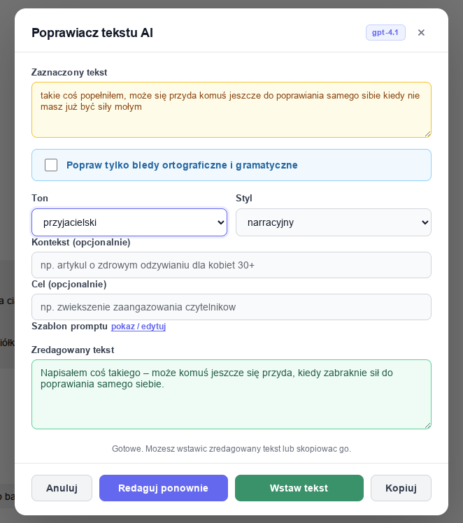
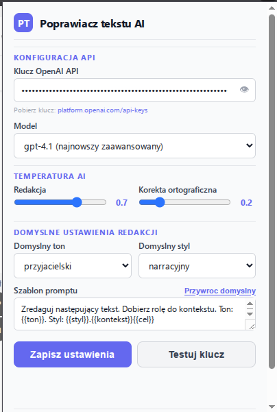

# Poprawiacz tekstu AI - Rozszerzenie Chrome

Rozszerzenie Chrome do redagowania zaznaczonego tekstu na dowolnej stronie internetowej za pomoca AI (OpenAI API). Streaming odpowiedzi, korekta ortograficzna, undo, konfigurowalna temperatura i wiele wiecej.

## Funkcje

### Redakcja tekstu
- **Redakcja zaznaczonego tekstu** - zaznacz tekst, kliknij prawym i wybierz "Redaguj zaznaczony tekst (AI)" lub uzyj skrotu `Ctrl+Shift+R`
- **Korekta ortograficzna** - checkbox "Popraw tylko bledy ortograficzne i gramatyczne" (bez zmiany tonu/stylu)
- **Konfiguracja tonu** - przyjacielski, profesjonalny, formalny, nieformalny, entuzjastyczny, neutralny, perswazyjny, empatyczny
- **Konfiguracja stylu** - informatywny, narracyjny, opisowy, zwiezly, szczegolowy, marketingowy, techniczny, konwersacyjny
- **Kontekst i cel** - dodaj kontekst oraz cel redakcji (zapamietywane miedzy sesjami)
- **Edytowalny szablon promptu** - pelna kontrola nad instrukcja wysylana do AI (z mozliwoscia przywrocenia domyslnego)

### UX i wydajnosc
- **Streaming odpowiedzi** - tekst pojawia sie token-by-token w czasie rzeczywistym
- **Skeleton screen** - animowany placeholder podczas oczekiwania na odpowiedz
- **Wstawianie + Undo** - wstaw zredagowany tekst na strone z mozliwoscia cofniecia zmiany
- **Przerwij/Abort** - przycisk "Przerwij" + timeout 60s + Escape przerywa operacje
- **Kopiowanie z feedbackiem** - przycisk zmienia sie na "Skopiowano!" na 1.5s
- **Timer** - wyswietla czas przetwarzania ("Redagowanie... (3s)")
- **Error banner z retry** - bledy wyswietlane jako banner z przyciskiem "Ponow probe"
- **Badge modelu** - aktualny model widoczny w naglowku modala
- **Walidacja dlugosci tekstu** - ostrzezenie przy dlugich tekstach, blokada przy >30k tokenow

### Konfiguracja (popup)
- **Klucz API** - z toggle widocznosci i linkiem do platform.openai.com
- **Testuj klucz** - przycisk walidujacy polaczenie z API
- **Model** - gpt-4o-mini, gpt-4o, gpt-4.1-mini, gpt-4.1
- **Temperatura** - osobna dla redakcji (domyslnie 0.7) i korekty ortograficznej (domyslnie 0.2)
- **Domyslny ton i styl**
- **Szablon promptu** - z przyciskiem "Przywroc domyslny"

## Zrzuty ekranu

*Modal redakcji tekstu z podgladem wyniku AI*

*Konfiguracja wtyczki: klucz API, model, temperatura, ton, styl*

## Instalacja

1. Otworz Chrome i przejdz do `chrome://extensions/`
2. Wlacz **Tryb dewelopera** (przelacznik w prawym gornym rogu)
3. Kliknij **Zaladuj rozpakowane**
4. Wskazz folder `contenet_redaktor`

## Konfiguracja

1. Kliknij ikone rozszerzenia na pasku narzedzi
2. Wpisz klucz API OpenAI (`sk-...`) i kliknij **Testuj klucz**
3. Wybierz model i dostosuj temperature
4. Ustaw domyslny ton, styl i szablon promptu
5. Kliknij **Zapisz ustawienia**

## Uzycie

1. Zaznacz tekst na dowolnej stronie
2. Uzyj `Ctrl+Shift+R` lub kliknij prawym przyciskiem -> **"Redaguj zaznaczony tekst (AI)"**
3. W oknie modalnym dostosuj ton, styl, kontekst i cel (lub zaznacz korekta ortograficzna)
4. Kliknij **Redaguj**
5. Po otrzymaniu wyniku kliknij **Wstaw tekst** lub **Kopiuj**
6. W razie potrzeby kliknij **Cofnij zmiane** aby przywrocic oryginalny tekst

## Zmienne w szablonie promptu

| Zmienna | Opis |
|---------|------|
| `{{ton}}` | Wybrany ton |
| `{{styl}}` | Wybrany styl |
| `{{kontekst}}` | Dodatkowy kontekst |
| `{{cel}}` | Cel redakcji |
| `{{tekst}}` | Zaznaczony tekst |

## Skroty klawiszowe

| Skrot | Akcja |
|-------|-------|
| `Ctrl+Shift+R` (`Cmd+Shift+R` na Mac) | Otworz modal redakcji |
| `Escape` | Przerwij operacje / zamknij modal |

## Wymagania

- Google Chrome 88+
- Klucz API OpenAI (https://platform.openai.com/api-keys)
